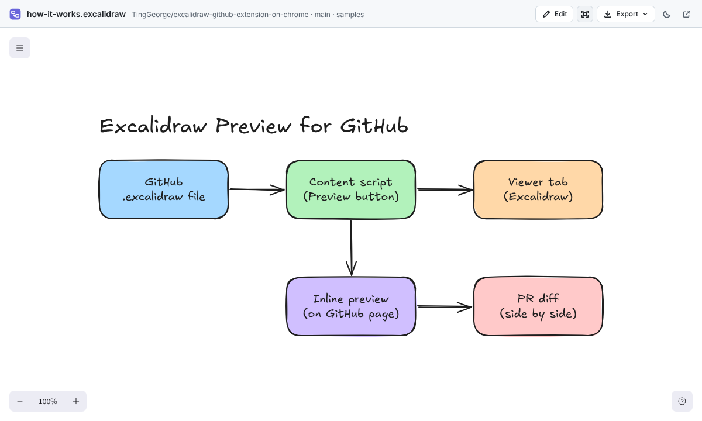
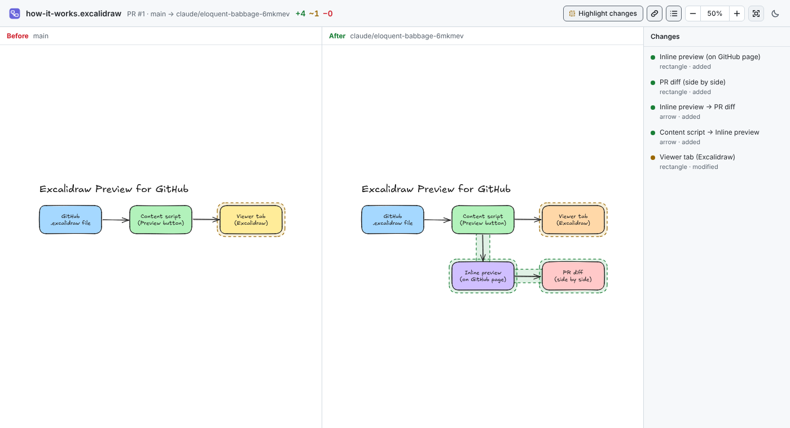
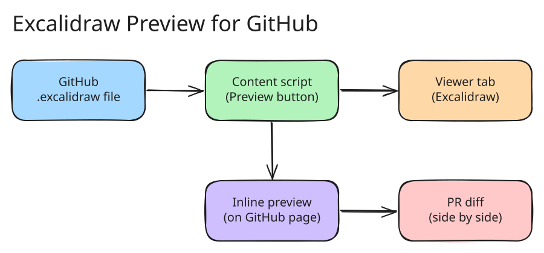

# Excalidraw Preview for GitHub

[](https://github.com/TingGeorge/excalidraw-github-extension-on-chrome/actions/workflows/ci.yml)

A Chrome extension that shows [Excalidraw](https://excalidraw.com) diagrams on GitHub as drawings instead of
hundreds of lines of JSON — in a new tab, inline on the file page, or as a side-by-side diff in pull requests.
Everything is rendered locally in your browser, so it works for **private repositories** too and nothing is
uploaded anywhere.

[繁體中文說明](#繁體中文)


## Features

- **Preview button** on every Excalidraw file on GitHub, next to _Raw · Copy · Download_. Opens the diagram in
  a new tab with pan, zoom and a light/dark theme.
- **Inline preview** — render the diagram right on the GitHub page instead of the source (resizable; can be
  turned on automatically for every diagram).
- **Pull request, commit and compare diffs** — a _Preview diff_ button on each changed Excalidraw file opens
  the old and new version side by side, with synchronised pan/zoom, added/removed/modified elements outlined,
  and a clickable list of changes.
- **Export** the diagram as PNG or SVG (with the scene embedded, so it stays editable in Excalidraw), copy it
  to the clipboard, or download it as a `.excalidraw` file.
- **Local edits** — switch to edit mode to try something out and export it; changes are never written back
  to GitHub.
- **Gists** — the same Preview / Inline buttons on every Excalidraw file of a gist.
- **Right-click any link** to an Excalidraw file on GitHub → _Preview Excalidraw diagram_.
- **Open local files** — drop a file onto the viewer (extension icon → _Open a local file…_).
- Follows GitHub's light/dark theme; UI in English and 繁體中文.





### Supported files

| File                                   | Notes                                                                                   |
| -------------------------------------- | --------------------------------------------------------------------------------------- |
| `*.excalidraw`, `*.excalidraw.json`    | Scenes saved by Excalidraw                                                              |
| `*.excalidraw.svg`, `*.excalidraw.png` | Images exported with **Embed scene**                                                    |
| any `*.svg` / `*.png` with a scene     | Detected automatically (can be turned off in settings)                                  |
| `*.excalidraw.md`                      | [Obsidian Excalidraw](https://github.com/zsviczian/obsidian-excalidraw-plugin) drawings |
| `*.excalidrawlib`                      | Libraries — all items are laid out in a grid                                            |

Try it on the files in [`samples/`](samples).

## Install

### From a release

1. Download `excalidraw-github-preview-<version>.zip` from the
   [Releases](https://github.com/TingGeorge/excalidraw-github-extension-on-chrome/releases) page (or the
   `excalidraw-github-preview` artifact of a CI run) and unzip it.
2. Open `chrome://extensions`, turn on **Developer mode**, click **Load unpacked** and select the unzipped
   folder.

### From source

```sh
npm ci
npm run build        # builds the extension into dist/
```

Then **Load unpacked** the `dist/` folder as above. `npm run dev` rebuilds on every change (click the reload
icon on `chrome://extensions` afterwards).

Works in Chrome, Edge, Brave, Arc and other Chromium browsers (version 120+).

## Usage

| Where                                         | What to do                                                                     |
| --------------------------------------------- | ------------------------------------------------------------------------------ |
| A file page (`/blob/…`)                       | Click **Preview** to open a tab, or **Inline** to show the drawing on the page |
| Pull request _Files changed_, commit, compare | Click **Preview diff** in the header of a changed Excalidraw file              |
| A gist                                        | Click **Preview** or **Inline** next to the file's **Raw** button              |
| Any link to an Excalidraw file                | Right-click → **Preview Excalidraw diagram**                                   |
| Your computer                                 | Extension icon → **Open a local file…**, then drop or choose a file            |

In the viewer: drag to pan, <kbd>Ctrl</kbd>/<kbd>⌘</kbd> + scroll to zoom, <kbd>Shift</kbd>+<kbd>1</kbd> or the
fit button to fit the drawing. In the inline preview, the mouse wheel scrolls the GitHub page until you click
the drawing.

Settings (extension icon → **All settings**): automatic inline preview, inline height, theme, diff buttons,
and detection of scenes embedded in plain `.svg`/`.png` files.

## Privacy and permissions

- **Read and change your data on github.com, gist.github.com and githubusercontent.com** — to add the buttons and to download
  the files you preview, using your existing GitHub session (that is what makes private repositories work).
- **Storage** — your settings, and the file you are previewing (kept locally for up to 7 days so a reload of
  the viewer tab works).
- **Context menus** — the right-click _Preview Excalidraw diagram_ entry.

The extension has no analytics and makes no requests to anything but GitHub. Excalidraw and its fonts are
bundled with the extension.

## How it works



- `src/content/` — content script on github.com. Detects Excalidraw files on file pages and diff pages, adds
  the buttons, downloads the file with the page's own session and hands it to the service worker. Handles
  GitHub's client-side navigation and both the classic and React diff views.
- `src/background/` — service worker. Stores previews in IndexedDB, opens viewer tabs, provides the context
  menu, and falls back to fetching files itself when needed.
- `src/viewer/` — the viewer page (React + `@excalidraw/excalidraw` in view mode), used both as a tab and as
  the inline iframe. Includes the diff view.
- `src/shared/` — file-type detection, GitHub URL parsing, scene diffing, settings and translations.

## Development

```sh
npm run typecheck     # TypeScript
npm run lint          # ESLint
npm run format        # Prettier
npm test              # unit tests (Vitest)
npm run build && npm run test:e2e   # end-to-end tests (Playwright + the real extension in Chromium)
npm run package       # build + zip into release/
npm run screenshots   # regenerate the images in docs/images (after npm run build)
```

The end-to-end tests load the built extension into Chromium and run it against **real GitHub pages captured
into `test/fixtures/github/`** (refresh them with `scripts/capture-fixtures.mjs`), so changes to GitHub's markup
show up as test failures. Sample files are generated by `scripts/make-samples.mjs` and
`scripts/export-samples.mjs`.

CI (`.github/workflows/ci.yml`) runs all checks and uploads the packaged extension for every push and pull
request. To publish a release with the zip attached, bump `version` in `package.json` and either push a tag
`v<version>` or run the **Release** workflow from the Actions tab (it creates the tag).

### Known limitations

- GitHub Enterprise Server (custom domains) is not supported yet.
- Images referenced from an Obsidian drawing's _Embedded files_ section are not shown.
- SVG exports embed full fonts instead of subsets (the font subsetter needs `eval`, which extensions may not
  use), so they are somewhat larger than exports from excalidraw.com.

---

## 繁體中文

一個 Chrome 擴充功能，讓你在 GitHub 上直接把 [Excalidraw](https://excalidraw.com) 圖檔當成「圖」來看，而不是幾百行
JSON。可以開新分頁預覽、直接內嵌在檔案頁面，或在 Pull Request 中並排比較變更前後的差異。所有渲染都在你的瀏覽器本機完成，
所以**私有 repo 也能用**，而且不會上傳任何資料到第三方。

### 功能

- **預覽按鈕**：在 GitHub 檔案頁面的 _Raw · Copy · Download_ 旁邊多一顆「預覽」，點下去在新分頁開啟圖，可以平移、縮放、
  切換淺色／深色主題。
- **內嵌預覽**：直接在 GitHub 頁面上顯示圖、取代原始碼（可調整高度，也可以設定成每次開啟圖檔都自動顯示）。
- **PR／commit／compare 差異預覽**：每個有變更的 Excalidraw 檔案都有「預覽差異」按鈕，左右並排顯示變更前後，平移縮放同步，
  新增／刪除／修改的元素會用顏色框起來，並列出可點擊的變更清單。
- **匯出** PNG 或 SVG（內含場景資料，之後還能用 Excalidraw 繼續編輯）、複製到剪貼簿、下載成 `.excalidraw`。
- **本機編輯**：切到編輯模式隨意修改、匯出；變更絕對不會寫回 GitHub。
- **Gist**：gist 裡的每個 Excalidraw 檔案也有「預覽」和「內嵌」按鈕。
- 在任何 Excalidraw 檔案連結上**按右鍵** →「預覽 Excalidraw 圖」。
- **開啟本機檔案**：點擴充功能圖示 →「開啟本機檔案…」，把檔案拖進去即可。
- 自動跟隨 GitHub 的淺色／深色主題；介面支援英文與繁體中文。

### 支援的檔案

`*.excalidraw`、`*.excalidraw.json`、有勾選 **Embed scene** 匯出的 `*.excalidraw.svg`／`*.excalidraw.png`（任何內含場景的
`.svg`／`.png` 都會自動偵測）、Obsidian Excalidraw 外掛的 `*.excalidraw.md`，以及元件庫 `*.excalidrawlib`。
可以用 [`samples/`](samples) 裡的檔案試試看。

### 安裝

1. 從 [Releases](https://github.com/TingGeorge/excalidraw-github-extension-on-chrome/releases) 下載
   `excalidraw-github-preview-<版本>.zip` 並解壓縮（或自己 `npm ci && npm run build`，使用 `dist/` 資料夾）。
2. 打開 `chrome://extensions`，開啟右上角的 **開發人員模式**，按 **載入未封裝項目**，選擇解壓縮後的資料夾。

支援 Chrome、Edge、Brave、Arc 等 Chromium 瀏覽器（版本 120 以上）。

### 隱私與權限

- 讀取 github.com、gist.github.com 與 githubusercontent.com：用來加上按鈕，並用你目前的 GitHub 登入狀態下載要預覽的檔案（所以私有 repo 也能用）。
- 儲存空間：存放設定，以及正在預覽的檔案（只存在本機、最多 7 天，讓重新整理預覽分頁時還能顯示）。
- 右鍵選單：提供「預覽 Excalidraw 圖」。

沒有任何追蹤或分析，除了 GitHub 之外不會連到其他地方；Excalidraw 本體與字型都打包在擴充功能裡。
